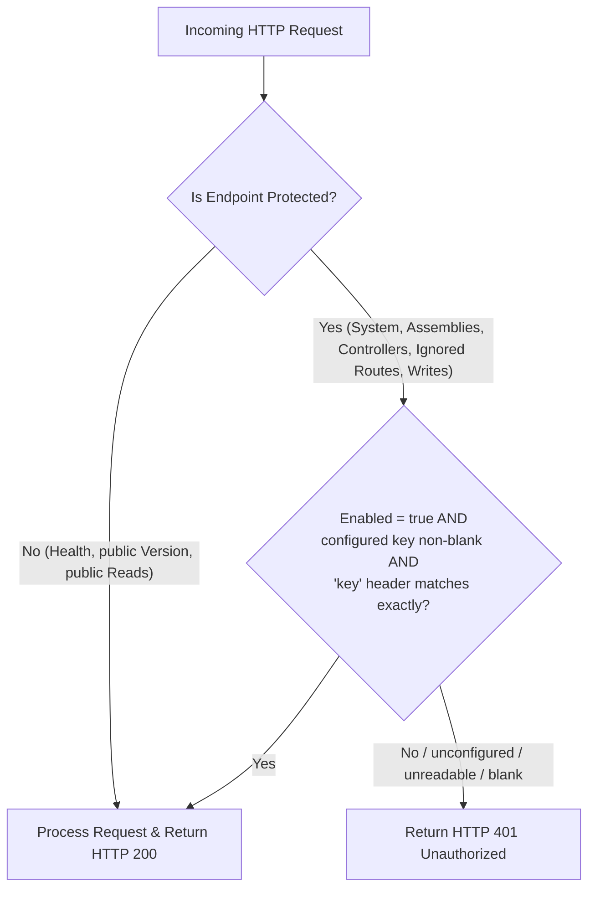

# Coding — WebAPI Simple Authorization (Tiered Access & API Key Protection)

Guidelines for implementing lightweight, API-key-based tiered authorization across DiGi WebAPI microservices, controllers, and diagnostic/administrative endpoints.

> [!CAUTION]
> **Deny by default.** Every branch that is not an exact key match must return HTTP 401 — a missing configuration file, an unreadable one, `Enabled=false`, a blank configured key, a blank supplied key. The first version of this pattern returned "authorized" whenever enforcement was not configured, and the result was that `api.digiproject.uk` served host telemetry, the full loaded-assembly inventory and the complete internal route catalog to anonymous callers, with a valid key sitting unused in the configuration file and a green 28-test suite. A protection that opens when it is unsure is not a protection.

---

## 1. Overview & Tiered Access Model

To protect sensitive operational telemetry, internal routing catalogs, and maintenance actions without the operational overhead of a full OAuth2/JWT identity provider, DiGi WebAPI endpoints employ a **Simple Tiered Authorization Pattern** governed by a local `.conf` configuration file.



### Access Tier Matrix
- **Public Tier (Open / No Key Required)**:
  - Public liveness, readiness, and uptime probes (e.g. `GET /information/health`).
  - Coarse version and runtime information (e.g. `GET /information/version` — assembly versions and framework description).
  - Public route catalogs (e.g. `GET /information/endpoints` restricted to routes the API explorer already publishes).
  - Standard unauthenticated read paths.
- **Protected Tier (Guarded by the `key` header)**:
  - Detailed host telemetry, GC heap allocations, thread pool loads (e.g. `GET /information/system`).
  - Dynamic assembly and plugin inspections (e.g. `GET /information/assemblies`).
  - Deployed controller inventories with route prefixes (e.g. `GET /information/controllers`).
  - Hidden internal and write endpoint catalogs (e.g. `GET /information/endpoints?includeignored=true`).
  - Source control commit hashes on otherwise public responses — see §6.
  - Administrative and internal maintenance actions.

---

## 2. Architecture & DiGi.Core Pattern

Follow the standard DiGi.Core separation of data models and extension methods.

### A. Data Model (`/Classes/[Feature]Configuration.cs`)
Anemic serializable model holding authorization settings. Three members: the key, whether enforcement is configured, and the single explicit escape hatch.

```csharp
public class DiagnosticsConfiguration : SerializableObject, IWebAPISerializableObject
{
    [JsonInclude, JsonPropertyName(nameof(Enabled))]
    private readonly bool enabled;

    [JsonInclude, JsonPropertyName(nameof(Key))]
    private readonly string? key;

    [JsonInclude, JsonPropertyName(nameof(Open))]
    private readonly bool open;

    // The parameterless form must deny every protected request - it is what an unconfigured host gets.
    public DiagnosticsConfiguration(string? key = null, bool enabled = false, bool open = false)
        : base()
    {
        this.key = key;
        this.enabled = enabled;
        this.open = open;
    }

    // Copy and JSON constructors per the standard three-constructor pattern.
}
```

`Open` exists so local development is not bricked by deny-by-default. It is the **only** setting that grants unauthenticated access to the protected tier, it is never set on a deployed host, and honouring it logs a warning.

### B. Standard Constant (`/Constants/FileName.cs`)
```csharp
public static class FileName
{
    public const string WebAPI_Diagnostics = "WebAPI_Diagnostics.conf";
}
```

### C. Factory Method (`/Create/[Feature]Configuration.cs`)
Probe for the file, then **fail closed** — the final fallback carries no key and therefore authorizes nothing:

```csharp
public static DiagnosticsConfiguration DiagnosticsConfiguration(string? path = null)
{
    // ... resolve path from the explicit argument, the base directory, then the current directory ...

    if (!string.IsNullOrWhiteSpace(resolvedPath) && System.IO.File.Exists(resolvedPath))
    {
        ConfigurationFile configurationFile = new();
        if (configurationFile.Read(resolvedPath))
        {
            string? key = configurationFile.GetValue<string>(nameof(Classes.DiagnosticsConfiguration.Key));
            bool enabled = configurationFile.GetValue<bool>(nameof(Classes.DiagnosticsConfiguration.Enabled), defaultValue: !string.IsNullOrWhiteSpace(key));
            bool open = configurationFile.GetValue<bool>(nameof(Classes.DiagnosticsConfiguration.Open), defaultValue: false);

            // Log a warning for Open=true and for a configuration that cannot authorize anyone.
            return new DiagnosticsConfiguration(key, enabled, open);
        }
    }

    string? envKey = Environment.GetEnvironmentVariable("DIGI_DIAGNOSTICS_KEY");
    if (!string.IsNullOrWhiteSpace(envKey))
    {
        return new DiagnosticsConfiguration(envKey, enabled: true);
    }

    // No configuration found: enforcement on, no key -> the protected tier answers 401.
    return new DiagnosticsConfiguration(null, enabled: true);
}
```

Probe only paths that the build actually produces. `CopyFiles` and `CopyUserFiles` both flatten into the output root, so `bin/user files/` never exists — probing it is dead code that reads as a working fallback.

Log at `Warning` on every path that ends with an unusable configuration. A silently open or silently closed diagnostics surface is how this defect survived a full test suite and a live deployment.

### D. Authorization Query Extension (`/Query/IsAuthorized.cs`)
```csharp
public static bool IsAuthorized(this DiagnosticsConfiguration? diagnosticsConfiguration, string? key)
{
    if (diagnosticsConfiguration is null)
    {
        return false;
    }

    if (diagnosticsConfiguration.Open)
    {
        return true;
    }

    if (!diagnosticsConfiguration.Enabled)
    {
        return false;
    }

    string? key_Configured = diagnosticsConfiguration.Key;

    if (string.IsNullOrWhiteSpace(key_Configured) || string.IsNullOrWhiteSpace(key))
    {
        return false;
    }

    byte[] bytes_Configured = Encoding.UTF8.GetBytes(key_Configured);
    byte[] bytes_Provided = Encoding.UTF8.GetBytes(key);

    return CryptographicOperations.FixedTimeEquals(bytes_Configured, bytes_Provided);
}
```

Two rules this encodes:
- **`Enabled == false` means "no key check is configured", not "let everyone in".** Reading it the other way is what shipped the endpoints open.
- **Compare in constant time.** `string.Equals` returns on the first differing byte and leaks the length of the matching prefix. `CryptographicOperations.FixedTimeEquals` also handles the length mismatch without an early return.

---

## 3. Controller Implementation Pattern

1. **Constructor injection with a factory fallback**, and register the configuration **once** on the host — a controller is activated per request, so a constructor that loads the file performs disk I/O on every call, including unauthenticated public ones:
   ```csharp
   // Host: DiGi.WebAPI.WindowsService/Program.cs, before AddControllers()
   serviceCollection.AddSingleton(WebAPI.Create.DiagnosticsConfiguration());
   ```
   ```csharp
   public InformationController(DiagnosticsConfiguration? diagnosticsConfiguration = null)
   {
       this.diagnosticsConfiguration = diagnosticsConfiguration ?? Create.DiagnosticsConfiguration();
   }
   ```
2. **Bind the key from the request header, never the query string:**
   ```csharp
   [HttpGet("system")]
   [ProducesResponseType(StatusCodes.Status401Unauthorized)]
   public async Task<IActionResult> GetSystemAsync([FromHeader(Name = "key")] string? key = null, CancellationToken cancellationToken = default)
   {
       if (!diagnosticsConfiguration.IsAuthorized(key))
       {
           return Unauthorized();
       }

       // ...
   }
   ```
   A query string is written to Kestrel and IIS access logs, to `Referer` headers, to browser history, to shell history, and to the plaintext first leg of a `UseHttpsRedirection` 307. A header is not. Use `[FromHeader]` rather than reading `Request.Headers` directly so the parameter still appears in Swagger. HTTP header names are case-insensitive, and `RouteOptions.LowercaseQueryStrings` does not apply to them.
3. **Keep `CancellationToken` last (CA1068)** — insert the key parameter before it.
4. **Response protocol**: unauthorized → **`HTTP 401 Unauthorized`** (`return Unauthorized();`); authorized → **`HTTP 200 OK`** with the JSON payload.
5. **A second gate on the same action is indistinguishable from the first.** Write endpoints commonly check the key *and* a per-dataset feature flag, and both `return Unauthorized()`. On the wire they are one 401 with no body, so a caller cannot tell "your key is wrong" from "this dataset is not writable here" — and will spend the time on the wrong one.
   - **An absent flag denies.** `ConfigurationFile.GetValue<bool>(nameof(AllowUpdateX))` with **no `defaultValue`** returns `false` when the key is missing, so a conf written before the flag existed rejects every write and **no key can fix it**. That is correct deny-by-default behaviour and must not be "fixed" by defaulting to `true`; the deployment is what needs updating.
   - **Ship every flag in the committed default** (`files/WebAPI_[Feature].conf`) so a diff against a deployed conf shows what it is missing. A flag added to the code but not to the committed default leaves every existing host silently denying.
   - **Log the two cases differently** even though the response is identical — the server log is the only place the distinction survives.
   - **Worked example.** `BuildingDataController.UpdateItemsByCountyIdsAsync` returns `Unauthorized()` from the key check and again from `if (!GISWebAPIConfigurationFileWatcher.AllowUpdateBuildingData)`. A deployed `GIS_WebAPI.conf` predating that flag produced 401s that survived two key rotations and two full pipeline runs before the second gate was found.

---

## 4. Alignment with Build & Deployment Process

### A. Committed Default (`files/`) vs Secrets (`user files/`)
- **Committed default — `files/WebAPI_[Feature].conf`.** Ships deny-by-default values (`Enabled=false`, `Key=""`). Deployed to `bin/` by the `CopyFiles` target.
- **Runtime secret — `user files/WebAPI_[Feature].conf`.** Never committed. `CopyUserFiles` runs `AfterTargets="CopyFiles"`, guaranteeing that `user files/*.conf` always overwrites `files/*.conf` in `bin/`.

### B. `.gitignore` Enforcement
```gitignore
[Uu]ser [Ff]iles/
```
Verify with `git check-ignore -v "user files/WebAPI_Diagnostics.conf"`.

### C. MSBuild Output Target (`.csproj`)
```xml
<Target Name="CopyFiles" AfterTargets="Build">
  <ItemGroup>
    <_Files Include="$(ProjectDir)..\files\**\*.*" />
  </ItemGroup>
  <Copy SourceFiles="@(_Files)" DestinationFiles="@(_Files->'$(OutputPath)%(RecursiveDir)%(Filename)%(Extension)')" SkipUnchangedFiles="true" />
</Target>

<Target Name="CopyUserFiles" AfterTargets="CopyFiles">
  <ItemGroup>
    <_UserFiles Include="$(ProjectDir)..\user files\**\*.*" />
  </ItemGroup>
  <Copy SourceFiles="@(_UserFiles)" DestinationFiles="@(_UserFiles->'$(OutputPath)%(RecursiveDir)%(Filename)%(Extension)')" SkipUnchangedFiles="true" />
</Target>
```

### D. Deployment Synchronization (`SyncDirectories.ps1`)
1. **Phase 1** — microservice assemblies to `DiGi.WebAPI.WindowsService\bin\extensions\*`.
2. **Phase 2** — `DiGi.WebAPI.WindowsService\bin` to `SOFTWARE_DIRECTORY\DiGi.WebAPI.WindowsService`.

`SyncDirectory.ps1` clears the destination before copying, and excludes top-level `*.conf` from that wipe so configuration that exists only on the target machine survives a deployment. A conf the source also carries is still overwritten — meaning the deployed secret travels from a developer workstation. Prefer placing the production key on the server (or in `DIGI_DIAGNOSTICS_KEY`) and keeping it out of the build output entirely.

---

## 5. Automated Tests & Sanitization Standards

> [!IMPORTANT]
> **Zero Fragile Data Disclosure:** tests must **never** read real on-disk configuration, test machine secrets, or hardcoded environment paths. Write synthetic `.conf` files to `assembly.ReportsDirectory()` when the loader itself needs covering.

1. **Assert the denials, not just the grant.** A test suite that only proves "the right key works" passes while the endpoint is open to everyone. Cover every deny branch:
   ```csharp
   [Fact]
   public void DiagnosticsConfiguration_Authorization()
   {
       DiagnosticsConfiguration? diagnosticsConfiguration_Null = null;
       Assert.False(diagnosticsConfiguration_Null.IsAuthorized("any-key"));

       DiagnosticsConfiguration diagnosticsConfiguration_Default = new();
       Assert.False(diagnosticsConfiguration_Default.IsAuthorized(null));
       Assert.False(diagnosticsConfiguration_Default.IsAuthorized("any-key"));

       DiagnosticsConfiguration diagnosticsConfiguration_Disabled = new("test-mock-key", false);
       Assert.False(diagnosticsConfiguration_Disabled.IsAuthorized("test-mock-key"));

       DiagnosticsConfiguration diagnosticsConfiguration_BlankKey = new(null, true);
       Assert.False(diagnosticsConfiguration_BlankKey.IsAuthorized("any-key"));

       DiagnosticsConfiguration diagnosticsConfiguration_Enabled = new("test-mock-key", true);
       Assert.False(diagnosticsConfiguration_Enabled.IsAuthorized("TEST-MOCK-KEY"));
       Assert.True(diagnosticsConfiguration_Enabled.IsAuthorized("test-mock-key"));

       DiagnosticsConfiguration diagnosticsConfiguration_Open = new(null, false, true);
       Assert.True(diagnosticsConfiguration_Open.IsAuthorized(null));
   }
   ```
2. **Cover the unconfigured controller.** Assert that a controller built with a default-constructed configuration returns `UnauthorizedResult` from every protected action, and `ContentResult` from the public ones.
3. **Cover the loader.** Write synthetic conf files and assert the outcome through `IsAuthorized`, including the `Enabled=false` + valid-key shape that shipped open.
4. **Serialization roundtrip** via `Core.xUnit.Query.SerializationCheck(...)`, covering an instance with `Open` set.
5. **Unit tests are not enough.** They exercise the action method, not model binding. Confirm `[FromHeader]` binds by running the host and probing it — a wrong binding source produces a permanent 401 that no unit test sees.

---

## 6. What Belongs in the Public Tier

Assume the public tier is read by an anonymous attacker doing reconnaissance, and keep it to what a monitoring probe genuinely needs.

- **Commit hashes are protected.** An `AssemblyInformationalVersion` of the form `0.8.8.20260826151608+ec0a8cf…` identifies the exact revision of a **public** GitHub repository. Trim everything from the `+` separator for unauthorized callers and keep the build stamp; return the full value only on a valid key.
- **Loaded assembly inventories are protected.** Exact versions of every third-party dependency are a CVE-matching shortcut.
- **Controller and internal route catalogs are protected.** Publishing more than the API explorer already publishes hands over the write surface.
- **Health and coarse version are public.** They are what an uptime monitor needs and reveal nothing actionable.
